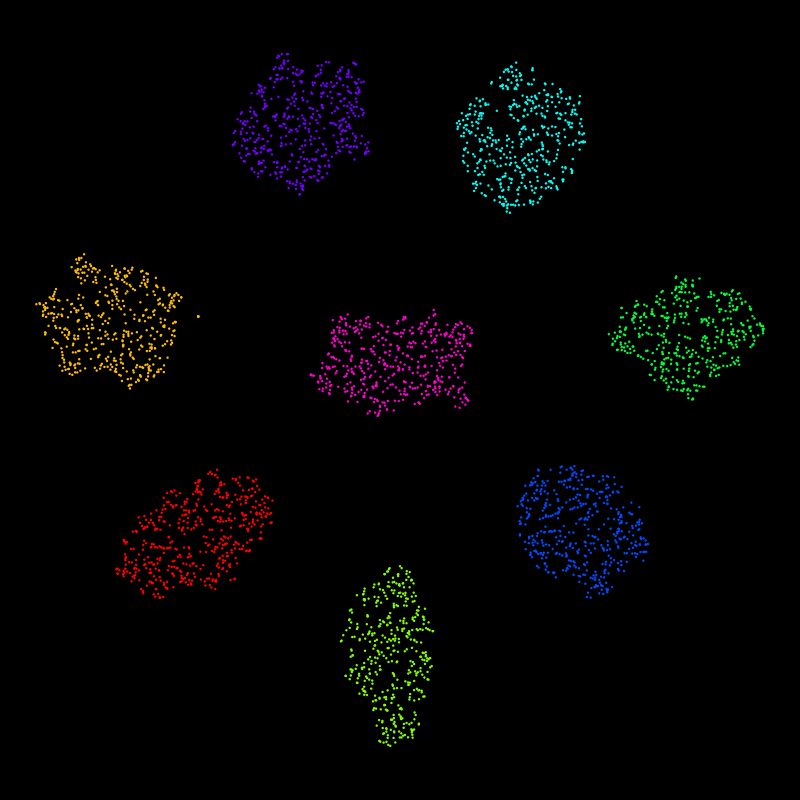
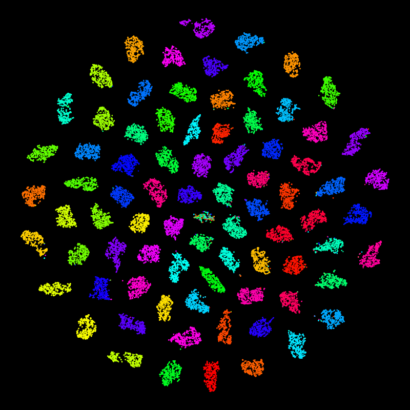
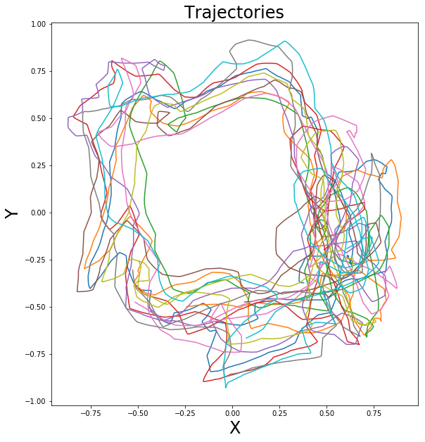
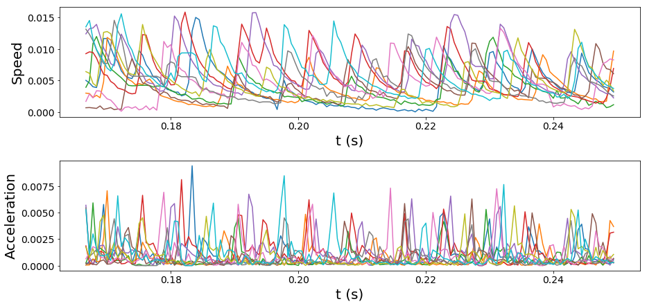
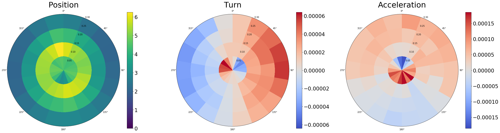
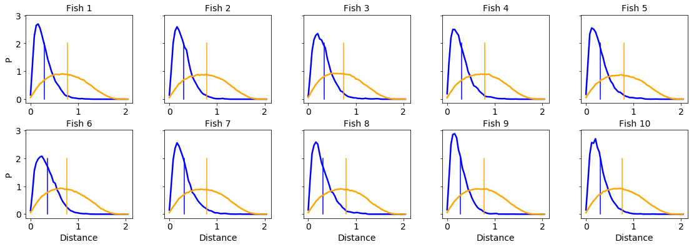

.. currentmodule:: idtrackerai

*************
Data analysis
*************

While idtracker.ai's job ends when the trajectory files are validated, users can utilize some external tools and analyses.

idtracker.ai objects inspection
===============================

The internal output files generated by idtracker.ai, located in the session folder, can be manually analyzed for further insights. Refer to the :ref:`Code Reference` for a guide to all methods and properties available for these objects.

Below is an example demonstrating how to regenerate trajectories from the :class:`ListOfBlobs` and extract additional information, such as the :class:`Blob` area. This example shows how to load the list of blobs, iterate through the frames, and extract the centroid and area of each identified blob:

.. dropdown:: Example to extract :class:`Blob` areas and trajectories
    :animate: fade-in
    :icon: code

    .. code:: python

        import numpy as np

        from idtrackerai import ListOfBlobs

        list_of_blobs = ListOfBlobs.load(
            "session_folder/preprocessing/list_of_blobs.pickle"
        )
        n_animals = 8

        trajectories = np.full((list_of_blobs.number_of_frames, n_animals, 2), np.nan)
        areas = np.full((list_of_blobs.number_of_frames, n_animals), np.nan)

        # ListOfBlobs.all_blobs is a flatten view of ListOfBlobs.blobs_in_video
        # for blob in blobs.all_blobs:

        for blobs_in_frame in list_of_blobs.blobs_in_video:
            for blob in blobs_in_frame:
                blobs_identities = list(blob.final_identities)
                blobs_centroids = list(blob.final_centroids)

                # identity=0 is a null identity, non-identified blob.
                # identity=None means the blob has not been processed by idtracker.ai,
                # this can happen in unfinished sessions

                for identity, centroid in zip(blobs_identities, blobs_centroids):
                    if identity not in (None, 0):
                        trajectories[blob.frame_number, identity - 1] = centroid

                # extract, for example, the blob area when the blob is an individual
                if blob.is_an_individual and len(blobs_identities) == 1:
                    identity = blobs_identities[0]
                    if identity not in (None, 0):
                        areas[blob.frame_number, identity - 1] = blob.area

                        # other properties from the blob
                        #   - blob.convexHull  # np.ndarray
                        #   - blob.bbox_corners  # tuple[tuple[int, int], tuple[int, int]]
                        #   - blob.extension  # float
                        #   - blob.centroid  # tuple[float, float]
                        #   - blob.orientation  # float

Cluster inspection
==================

After a successful tracking session with version 6 or higher, the clusters of the embedded images can be inspected via the command ``idtrackerai_inspect_clusters``.

.. admonition:: Data policy
    :class: sidebar warning

    ``idtrackerai_inspect_clusters`` works with sessions tracked with :ref:`data policy <output>` ``idmatcher.ai`` or ``all``.

This uses the trained contrastive network (`ResNet`) to compute and store the image embeddings in a CSV file. It then generates a scatter plot of their *t-SNE* representation, enabling visual inspection of the resulting clusters. The results are saved in `"session_folder/cluster_inspection"`.

Predicted identities stored in the session's :class:`ListOfFragments` are used to color the scatter plot (``predicted_t-SNE.png``) and populate the *predicted_id* column in the CSV file. Groundtruth identities can be added by providing a path to a validated trajectory file with the argument ``--gt_path`` (see below), this generates an additional scatter plot with these identities (``groundtruth_t-SNE.png``) and populates the *groundtruth_id* column.

.. div:: sd-text-center

    Examples of *t-SNE* visualizations of image embeddings using the videos *test_B.avi* from :ref:`Test the installation` (left) and *drosophila_80* from the :external:`data repository <https://drive.google.com/drive/folders/1kAB2CDMmgoMtgFQ_q1e8Y4jhIdbxKhUv>` (right).

By running ``idtrackerai_inspect_clusters -h``, a list of all available options is displayed:

    --images_per_id  Sets the maximum number of images per animal to sample for speeding up *t-SNE* computation. The default value is 500. To disable subsampling, set this option to 'inf'. Note that subsampling is performed randomly across all identities, so the exact number of images per class may vary.
    --gt_path    Specifies the path to the ground truth trajectories used to compare image centroids and extract their ground truth identities. These identities are used to assign colors in the groundtruth scatter plot and populate the *groundtruth_id* column in the CSV output. The path can point to a trajectory file or a session folder.

Trajectorytools
===============

.. |colab-badge0| raw:: html

    

.. |colab-badge1| raw:: html

    

.. |colab-badge2| raw:: html

    

.. |colab-badge3| raw:: html

    

A Python package that performs basic trajectory analysis and it is available at https://gitlab.com/polavieja_lab/trajectorytools.

In https://gitlab.com/polavieja_lab/idtrackerai_notebooks you can find some analysis notebooks present in [1]_ and implemented with *trajectorytools*. The repository includes the following notebooks:

- **T0_loading_idtrackerai_trajectories.ipynb** |colab-badge0| Shows how to load, preprocess, and visualize animal trajectories from idtracker.ai using trajectorytools.
- **T1_trajectories_analysis.ipynb** |colab-badge1| Analyzes distributions and statistics of positions, speeds, accelerations, and curvatures from trajectory data.
- **T2_bouts_analysis.ipynb** |colab-badge2| Detects and analyzes fish movement bouts, including bout durations, speed changes, and kinematic features.
- **T3_collective_trajectories_analysis.ipynb** |colab-badge3| Examines collective behavior, group metrics, neighbor interactions, and inter-individual distances in animal groups.

Here we present some of the analysis we get with the notebooks above using a 10 juvenile fish video:

.. image:: ../_static/ipynb/density_of_neighbours.png
    :height: 300
    :align: right
    :alt: Neighbors density plot of zebrafish tracked with idtracker.ai

.. div:: sd-text-center

    Smoothed trajectories (left) and density of neighbors around a focal fish (right)

    Velocities and accelerations

    Polar distributions of positions, turnings and accelerations

    Inter-individual distance histograms compared with shuffled trajectories

Fish Midline
============

A short Python script available at https://gitlab.com/polavieja_lab/midline to extract posture information of animals tracked with idtracker.ai. Intended to be used with fish data but easily customizable and adaptable.

.. figure:: https://gitlab.com/polavieja_lab/midline/-/raw/master/example.gif
    :width: 70%

    Example of posture information extracted with Fish Midline.

.. rubric:: References

.. [1] :external:`Hinz, R. C., & de Polavieja, G. G. (2017). Ontogeny of collective behavior reveals a simple attraction rule. Proceedings of the National Academy of Sciences, 114(9), 2295-2300. <https://doi.org/10.1073/pnas.1616926114>`
