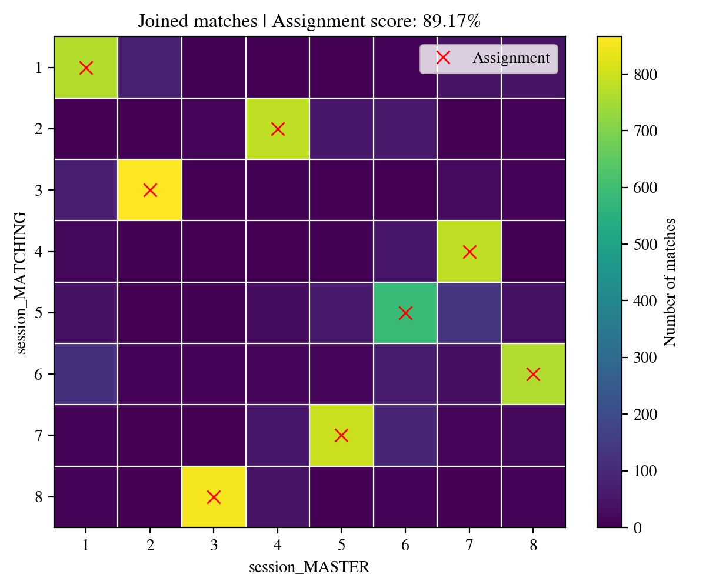

************
idmatcher.ai
************

idmatcher.ai is a tool included in idtracker.ai published in [1]_ that links animal identities across separate tracking sessions of the same group. Track each video independently with idtracker.ai, then run idmatcher.ai to find which identity in one session corresponds to which identity in another.

For best results, the sessions being matched should meet the following conditions:

- **Same identification image size.** Identification networks cannot process images whose size differs from what they were trained on. Use :ref:`Knowledge transfer` to lock the image size to the same value across all sessions.
- **Same (or very similar) segmentation parameters** (intensity thresholds, background subtraction, etc.). Small differences in how animals appear in the identification images can make matching unreliable.
- **Same idtracker.ai version.** Different versions can produce slightly different identification images, degrading match quality.

To run idmatcher.ai, pass a list of successfully tracked session folders to the command:

.. code-block:: bash

    idmatcherai path/to/session_MASTER path/to/session_MATCHING_A path/to/session_MATCHING_B ...

idmatcher.ai will match every session (starting from the second session on the list) with the master session (the first on the list). In the example above, for example, idmatcher.ai would perform two matches, ``MATCHING_A`` with ``MASTER`` and ``MATCHING_B`` with ``MASTER``.

When matching a pair of sessions, say matching ``MATCHING`` with ``MASTER``, all the individual images from ``MATCHING`` are identified using the identification network of ``MASTER``. This creates a **direct matching matrix**. In this matrix, every row contains the identity predictions (according to ``MASTER``) of the images belonging to the same identity of ``MATCHING``. This matrix is saved in a *.csv* file and plotted in a *.png* image.

.. note::
    In this example, all results would be stored in ``path/to/session_MATCHING/matching_results/session_MASTER``

Then, images from ``MASTER`` are identified with the identification network of ``MATCHING`` in the reverse order, generating an **indirect matching matrix**. This matrix is also saved in *.csv* and *.png* files.

Finally, both direct and indirect matching matrices are joined into a single matrix (saved in a *.csv* file and a *.png* image as the one below).

    *Joined matching matrix* example from idmatcher.ai

Each row of the joined matrix is assigned to a different column to maximize the number of matches using the :wikipedia:`Hungarian algorithm`. The assignment is saved in a ``assignments.csv`` file where identities of ``MATCHING`` (first column of the *csv*) are matched with identities of ``MASTER`` (second column). This assignment is also plotted in the *.png* files as red crosses.

Finally, the matching scores (direct and indirect) are computed for every assigned pair. A matching agreement is also computed as the ratio of matches agreeing with the proposed assignment.

.. caution::
    The identification of an animal never seen by the identification network will always produce an erroneous and unpredictable result.

    That's why, when matching sessions with different number of animals, the images from the session with the higher number of animals are not taken into account during assignment. Only the images from the session with the lower number of animals are used for the assignment process.

    In this scenario, both direct and indirect assignment scores can be used to confirm the assignment.

.. dropdown:: How are scores computed?
    :animate: fade-in
    :icon: info
    :color: secondary

    Suppose matching ``MATCHING`` with ``MASTER``.

    :math:`D_{n,m}` is the direct matching matrix containing the number of images with identity :math:`n` in ``MATCHING`` being identified as identity :math:`m` by ``MASTER``. :math:`I_{n,m}` is the indirect matching matrix containing the number of images with identity :math:`m` in ``MASTER`` being identified as identity :math:`n` by ``MATCHING``.

    Every identity assignment :math:`i \rightarrow j` has two associated vectors:

    - The   direct vector :math:`D_{n=i,m}` (the :math:`i_{\text{th}}`    row of the   direct matching matrix).
    - The indirect vector :math:`I_{n,m=j}` (the :math:`j_{\text{th}}` column of the indirect matching matrix).

    where both vectors have their assigned values :math:`D_{n=i,m=j}` and :math:`I_{n=i,m=j}`.

    The direct and indirect scores :math:`S` of the assignment :math:`i\rightarrow j` are computed as the normalized distance between the assigned value and the next highest value (the major competitor):

    .. math::

        S_{i\rightarrow j} = \left[
        \frac{D_{n=i,m=j}-\max{\left( D_{n=i,m\ne j}\right) }}{\max{\left( D_{n=i,m}\right) }},
        \frac{I_{n=i,m=j}-\max{\left( I_{n\ne i,m=j}\right) }}{\max{\left( I_{n,m=j}\right) }}\right]

.. centered::
    Funded by FCT under project PTDC/BIA-COM/5770/2020

.. rubric:: References

.. [1] :external:`Romero-Ferrero, F., Heras, F. J., Rance, D., & de Polavieja, G. G. (2023). A study of transfer of information in animal collectives using deep learning tools. Philosophical Transactions of the Royal Society B, 378(1874), 20220073. <https://doi.org/10.1098/rstb.2022.0073>`
