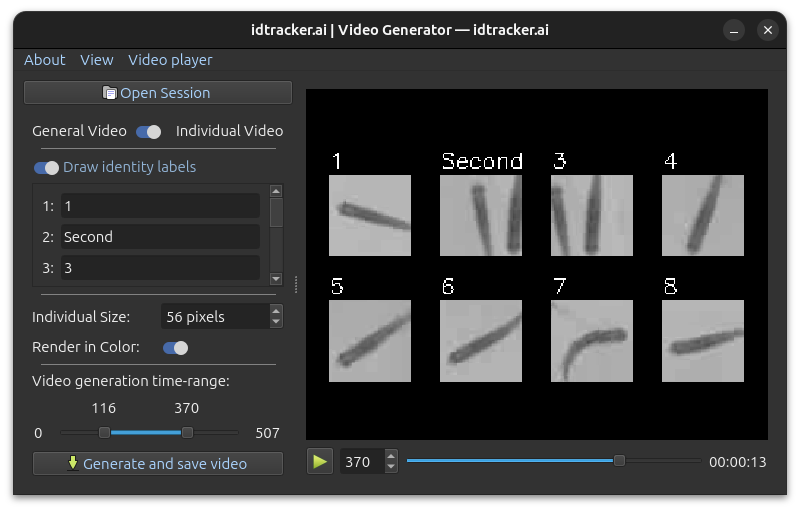
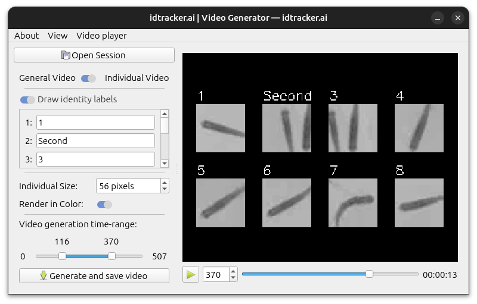

***************
Video Generator
***************

.. admonition:: This is a visualization tool only
    :class: sidebar note

    The Video Generator is intended only for visualizing tracking results. To correct tracking errors or edit results, please use the :ref:`validator_reference`.

idtracker.ai provides a graphical tool to generate *tracked videos* from your tracking sessions. These videos visualize animal trajectories and can be used for further analysis or sharing results.

To launch the video generator, run:

.. code-block:: bash

    idtrackerai_video

This opens a graphical interface where you can load your session and customize the video output.

    idtracker.ai's video generator application (in *dark* mode)

    idtracker.ai's video generator application (in *light* mode)

You can generate two types of videos:

.. admonition:: Pose estimation
    :class: sidebar tip

    Individual videos are ideal for extracting animal pose information with tools like :external:`SLEAP <https://sleap.ai/>` and :external:`DeepLabCut <http://www.mackenziemathislab.org/deeplabcut/>`.

- **General Video**: Shows the original video with all animal trajectories and optional labels overlaid (see the Youtube video on the left).
- **Individual Videos**: Generates a separate video for each animal, showing only its own cropped region over time (see the Youtube video in the center), plus a collage video displaying all individuals in a grid (see the Youtube video on the right).

.. raw:: html

    

    <iframe width="240" height="200" src="https://www.youtube.com/embed/U9JPLU5rlq0?loop=1&modestbranding=1&rel=0&playlist=U9JPLU5rlq0" frameborder="0" allowfullscreen></iframe>
    <iframe width="150" height="200" src="https://www.youtube.com/embed/yNRAtI5ZJh8?loop=1&modestbranding=1&rel=0&playlist=yNRAtI5ZJh8" frameborder="0" allowfullscreen></iframe>
    <iframe width="320" height="200" src="https://www.youtube.com/embed/cCOfTAU_3JA?loop=1&modestbranding=1&rel=0&playlist=cCOfTAU_3JA" frameborder="0" allowfullscreen></iframe>
    

.. admonition:: Resize video output
    :class: tip

    Use the resize option in the general video (full view with labels) to adjust the output video size. This can help reduce the output video file size, speed up the video generation and make it easier to share or store.

.. dropdown:: Alternative CLI
    :animate: fade-in
    :icon: terminal
    :color: secondary

    If you prefer to use the command line interface, run ``idtrackerai_video --run -h`` to display a list of all available options:

                --run          Generate the video without GUI
                --individual   Generate individual video. Default is a general video.
                --gray         Draw the original video in grayscale.
                --t            ``path`` Path to the trajectory file, default is session_dir/trajectories/trajectories*.
                --tl           ``int`` Trail length, number of points used to draw the individual trajectories traces in general videos. Default is 20.
                --s            ``int`` Frame where to start the video.
                --e            ``int`` Frame where to end the video.
                --size         ``int`` Size of the squared individual videos. Defaults to the median body length of the animals in pixels.
                --no-labels    Show centroids in general video without labeled IDs.

    Or check the Code reference :mod:`idtrackerai.extra_tools.video_generator` for calling the video generator from Python.
